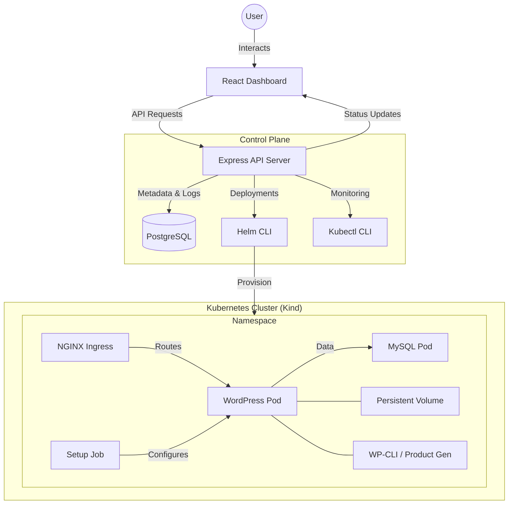

# ⚡ Store Provisioning Platform

A high-performance, automated platform for provisioning and managing WooCommerce stores on Kubernetes with a single click. This platform orchestrates the entire lifecycle of a store—from infrastructure deployment to product seeding—providing a production-ready environment in minutes.


---

## 🏗️ Architecture

The platform follows a modern microservices-inspired architecture, leveraging Kubernetes for container orchestration and Helm for package management.



---

## 🌟 Key Features

- **🚀 One-Click Provisioning**: Automates the creation of a full WooCommerce stack (WordPress + MySQL + Ingress).
- **🛡️ Namespace Isolation**: Each store runs in its own dedicated Kubernetes namespace for security and resource management.
- **📦 Automated Seeding**: Automatically generates products and configures payment methods (COD) upon creation.
- **📊 Real-time Monitoring**: Track provisioning status, logs, and events directly from the dashboard.
- **🛠️ Resource Management**: Uses Kubernetes ResourceQuotas and Limits to ensure cluster stability.
- **🐳 Local Development**: Optimized for running on **Kind** (Kubernetes in Docker).

---

## 🛠️ Tech Stack

- **Frontend**: React 18, Vite, Tailwind CSS, Lucide Icons.
- **Backend**: Node.js 18, Express, PostgreSQL 15.
- **Infrastructure**: Kubernetes (Kind), Helm 3, Docker.
- **Store Stack**: WordPress 6.4, WooCommerce, MySQL 8.0, WP-CLI.

---

## 📋 Prerequisites

Ensure you have the following installed:

1.  **Docker Desktop**: [Download](https://www.docker.com/products/docker-desktop/)
2.  **Node.js 18+**: [Download](https://nodejs.org/)
3.  **Kind**: `choco install kind` (Windows) or [Guide](https://kind.sigs.k8s.io/docs/user/quick-start/#installation)
4.  **kubectl**: `choco install kubernetes-cli` (Windows) or [Guide](https://kubernetes.io/docs/tasks/tools/)
5.  **Helm**: `choco install kubernetes-helm` (Windows) or [Guide](https://helm.sh/docs/intro/install/)

---

## 🚀 Quick Start Guide

### 1. Initialize Infrastructure

First, start the metadata database and create the Kubernetes cluster.

```bash
# Start PostgreSQL
docker-compose up -d

# Create Kind Cluster
kind create cluster --name store-platform --config kind-config-alt.yaml

# Install NGINX Ingress Controller
kubectl apply -f https://raw.githubusercontent.com/kubernetes/ingress-nginx/main/deploy/static/provider/kind/deploy.yaml

# Wait for Ingress to be ready
kubectl wait --namespace ingress-nginx --for=condition=ready pod --selector=app.kubernetes.io/component=controller --timeout=300s
```

### 2. Set Up Services

Install dependencies for both the backend and the dashboard.

```bash
# Backend
cd backend
npm install

# Dashboard
cd ../dashboard
npm install
```

### 3. Launch the Platform

Open two terminals to run the backend and frontend simultaneously.

**Terminal 1 (Backend):**
```bash
cd backend
npm run dev
```

**Terminal 2 (Dashboard):**
```bash
cd dashboard
npm run dev
```

---

## 🎮 Usage

1.  Open your browser to **http://localhost:3001**.
2.  Click **"+ Create Store"** in the top right.
3.  Enter a name for your store (e.g., "Tech Haven").
4.  Monitor the **Live Events** log as the platform:
    -   Installs the Helm chart.
    -   Configures the WordPress environment.
    -   Generates sample products.
5.  Once the status turns **Ready**, click **"🛒 Open Store"** to visit your new WooCommerce site.

---

## 📂 Project Structure

```text
├── backend/            # Express API, Orchestration logic, and DB migrations
├── dashboard/          # React/Vite frontend for store management
├── helm/               # WooCommerce Helm chart templates
│   └── woocommerce-store/
│       ├── templates/  # K8s manifests (WP, MySQL, Ingress, RBAC)
│       └── values.yaml # Default configurations
├── docker-compose.yml  # Local PostgreSQL setup
└── kind-config-alt.yaml # Kubernetes cluster configuration
```

---

## 🛡️ Troubleshooting

- **Ingress Issues**: Ensure port 8080 (or the port defined in `kind-config-alt.yaml`) is not in use by another application.
- **Database Connection**: Verify PostgreSQL is running with `docker ps`.
- **Pod Failures**: Use `kubectl get pods -A` to check the status of store-specific namespaces.

---

Built with ❤️ for rapid commerce experimentation.
